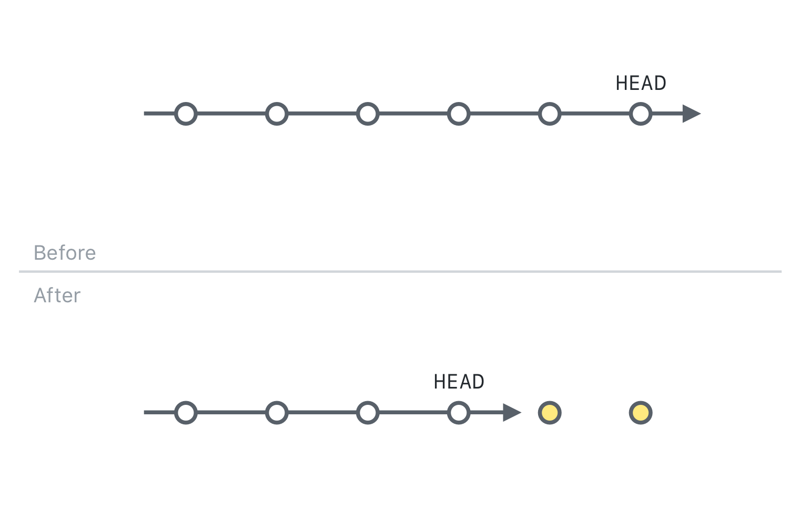
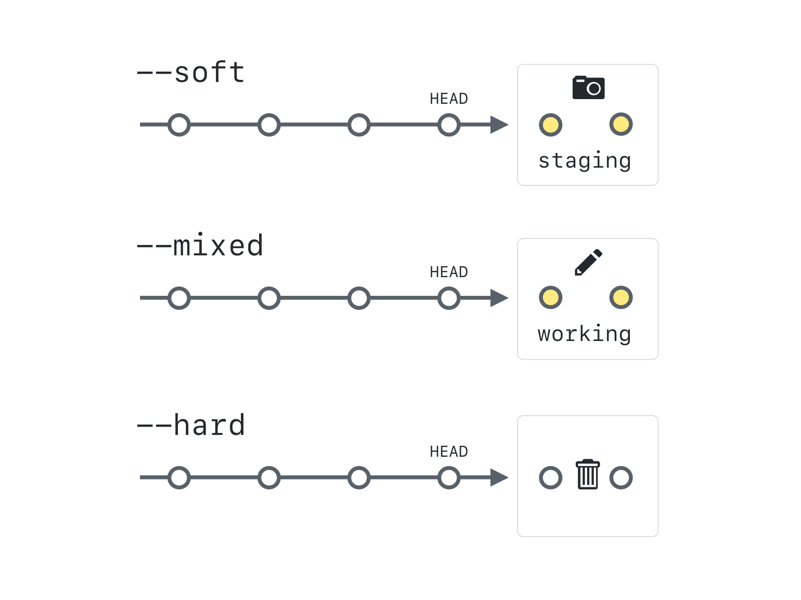

## Rewriting History with Git Reset

When you want to make changes to commits further back in history, you will need to use a more powerful command: `git reset`.

### Understanding Reset

Sometimes we are working on a branch and we decide things aren't going quite like we had planned. We want to reset some, or even all, of our files to look like what they were at a different point in history.



Remember, there are three different snapshots of our project at any given time. The first is the most recent commit (also known as HEAD). The second is the staging area (also called the index). The third is the working directory containing any new, deleted, or modified files.

The `git reset` command has three modes, and they allow us to change some or all of these three snapshots.

It also helps to know what branches technically are: each is a pointer, or reference, to the latest commit in a line of work. As we add new commits, the currently checked-out branch "moves forward," so that it always points to the most recent commit.

### Reset Modes



The three modes for git reset are: `--soft`, `--mixed`, and `--hard`. For these examples, assume that we have a "clean" working directory, i.e. there are no uncommited changes.

#### `--soft`
`git reset --soft <SHA>` moves the current branch to point at the `<SHA>`. However, the working directory and staging area remain untouched. Since the snapshot that current branch points to now differs from the index's snapshot, this command effectively stages all differences between those snapshots. This is a good command to use when you have made a large number of small commits and you would like to regroup them into a single commit.
#### `--mixed`
`git reset --mixed <SHA>` makes the current branch *and* the staging area look like the `<SHA>` snapshot. *This is the default mode:* if you don't include a mode flag, Git will assume you want to do a `--mixed` reset. `--mixed` is useful if you want to keep all of your changes in the working directory, but change whether and how you commit those changes.
#### `--hard`
`git reset --hard <SHA>` is the most drastic option. With this, Git will make all 3 snapshots, the current branch, the staging area, *and* your working directory, look like they did at `<other-commit>`. This can be dangerous! We've assumed so far that our working directory is clean. If it is not, and you have uncommitted changes, `git reset --hard` will *delete all of those changes*. Even with a clean working directory, use `--hard` only if you're sure you want to completely undo earlier changes.

### Reset Soft

Using the practice repository we created earlier, let's try a `reset --soft`.

1. View the history of our project: `git log --oneline --decorate`
1. Identify the current location of `HEAD`.
1. Go back two commits in history: `git reset --soft HEAD~2`
1. See the tip of our branch (and `HEAD`) is now sitting two commits earlier than it was before: `git log --oneline --decorate`
1. The changes we made in the last two commits should be in the staging area: `git status`
1. All the files still exist locally: `ls`
1. Let's remove the extra file we created earlier: `git rm --cached file7.md`
1. Now, we'll re-commit these changes without the extra file: `git commit -m "re-add file 5 and 6"`

> In this example, the tilde tells git we want to reset to two commits before the current location of `HEAD`. You can also use the first few characters of the commit ID to pinpoint the location where you would like to reset.

### Reset Mixed

Next we will try the default mode of reset, `reset --mixed`:

1. Once again, we will start by viewing the history of our project: `git log --oneline`
1. Go back one commit in history: `git reset HEAD~`
1. See where the tip of the branch is pointing: `git log --oneline --decorate`
1. The changes we made in the last commit have been moved back to the working directory: `git status`
1. All the files still exist locally: `ls`
1. Move the files to the staging area before we can commit them: `git add file5.md file6.md`
1. Re-commit the files: `git commit -m "re-add file 5 and 6"`


> Notice that although we have essentially made the exact same commit (adding file 5 and 6 together with the same HEAD and commit message) we still get a new commit ID. This can help us see why the reset command should never be used on commits that have been pushed to the remote.

### Reset Hard

Last but not least, let's try a hard reset.

1. Start by viewing the history of our project with: `git log --oneline`
1. Reset to the point in time where the only file that existed was the README.md: `git reset --hard <SHA>`
1. See that all of the commits are gone: `git log --oneline`
1. Notice your working directory is clean: `git status`
1. See that the only files in your repository are the README.md and file7.md: `ls`

> **Warning:** Remember, `git reset --hard` overwrites your working directory, staging area, and history. This means that uncommitted changes you have made to your files will be completely lost. Don't use it unless you really want to discard your changes. Any files that are untracked will remain and be unchanged.

### Does Gone Really Mean Gone?

The answer: It depends!

```sh
$ git reflog
```

The reflog is a record of every place HEAD has been. In a few minutes we will see how the reflog can be helpful in allowing us to restore previously committed changes. But first, we need to be aware of some of the reflog's limitations:

- **The reflog is only local.** It is not pushed to the remote and only includes your local history. In other words, you can't see the reflog for someone else's commits and they can't see yours.
- **The reflog is a limited time offer.** By default, reachable commits are displayed in the reflog for 90 days, but unreachable commits (meaning commits that are not attached to a branch) are only displayed for 30 days.

> Sometimes, you'll want to save your work in a commit without having to think of a commit message, or before you're ready to organize your changes. If that's the case, you can create aliases to create "save points". See the appendix with aliases to learn how!
