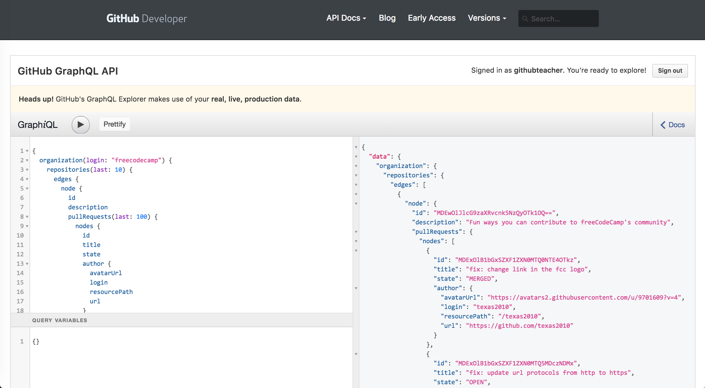
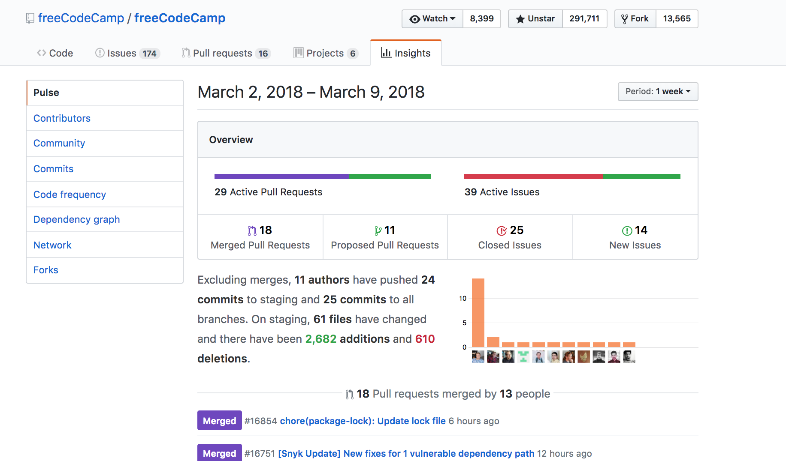

## More Possibilities

So far, we've gone through one pre-defined workflow. Hopefully at this point you're seeing how this general concept can be applied to your own teams and projects to automate more to reduce repetitive tasks and human error.

Let's explore some additional features and examples of how you can fully take advantage of a software development pipeline with GitHub.

### The GitHub API

GraphQL is a powerful way to interact with GitHub. If you find that you want something to integrate a certain way, but the tool doesn't exist, you can create custom tooling using GitHub's API and webhooks. Find more [documentation here](developer.github.com).

### Pulse/Graphs

We covered these briefly earlier, but let's talk a bit more about Pulse and Graphs.

When you want to know more about what's going on in any given repository, the "Insights" tab is the right place to look. Here you can see all sorts of valuable information about the code and the developers working on it.

Pulse is your project's dash board. It contains information on the work that has been completed and the work in progress. Graphs provide a more granular view into the repository activity, including who has contributed, when the work is being done, and who has forked the repository.

### Customize your pipeline

With integrations, configurable GitHub settings, and direct access to Git and GitHub data via the API, the possibilities of how your toolchain could look are endless.
